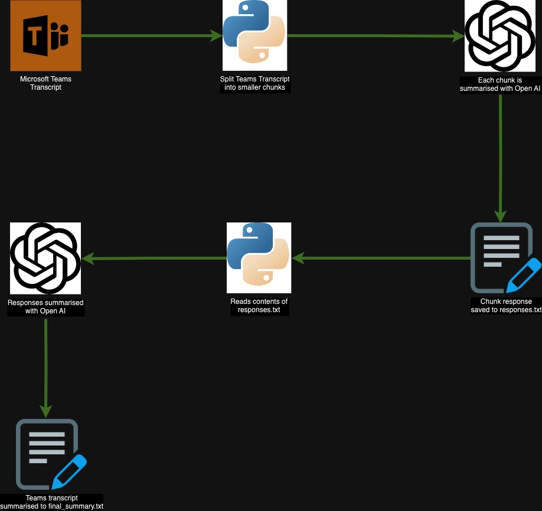

# Summarising Microsoft Teams Transcripts using Python and Azure Open AI

This repo reads a Teams transcript file (currently .docx), chunks it into smaller parts, prompts an Open AI model to process each chunk, and then generates a final summary of the entire document using Azure Open AI.

## Diagram

The diagram below shows the current flow:


# Prerequisites

- Python 3.12
- Azure Open AI subscription
- pip (Python package installer)
- virtualenv (for creating isolated Python environments)

# Setup

1. Clone the repository

```bash
git clone https://github.com/hmcts/microsoft-teams-transcript-summariser-python-openai.git
cd microsoft-teams-transcript-summariser-python-openai
``` 

2. Create a virtual environment

### On macOS and Linux

```bash
python3 -m venv venv
source vnv/bin/activate
```

### On Windows

```bash
python -m venv venv
venv\Scripts\activate
```

3. Install the required packages

```bash
pip install -r requirements.txt
```

4. Create a .env file in the root directory and add the following environment variables

```bash
FILE_PATH="<file_path>.docx"
AZURE_OPENAI_API_KEY="azure_openai_api_key"
AZURE_OPENAI_ENDPOINT="azure_openai_endpoint"
AZURE_OPENAI_DEPLOYMENT_NAME="azure_openai_deployment_name"

# prompts from prompt.json
INITIAL_PROMPT_SUMMARY="initial_prompt_summary_per_user_questions_answered"
FINAL_PROMPT_SUMMARY="final_prompt_summary_per_user_questions_answered"
```

# Usage

Run the following command to generate a summary of the Teams transcript

```bash
python summary.py
```

## Script Breakdown

1. Read and Chunk Document: The script reads a word doc and splits it into smaller chunks.
2. Prompt AI Model: Each chunk is processed by an AI model.
3. Save Responses: The responses from the AI model are saved to `responses.txt`
3. Generate Final Summary: The script reads the responses and prompts the AI model to generate a final summary, which is saved to `final_summary.txt`

### Prompts 

The script uses prompts to guide the AI model on what to generate. The prompts are stored in `prompt.json` and are read by the script.

Currently, it has three sets of prompts that reference 5 topical areas, which are: Overview, Concerns, Current Model, Questions/Thoughts to Address, To-Do Lists, and Outstanding Tasks
1. Overall Summary:
- Used to generate a general summary of the Teams transcript
- Prompts: `initial_prompt_summary` and `final_prompt_summary` 

2. Overall Summary Per User:
- Generates a summary that includes references to each user and their respective timestamps within the Teams transcript.
- Prompts: `initial_prompt_summary_per_user` and `final_prompt_summary_per_user`

3. Overall Summary Per User with Questions Answered:
- Creates a summary that includes references to each user, their timestamps, and the questions answered during the meeting.
- Prompts: `initial_prompt_summary_per_user_questions_answered` and `final_prompt_summary_per_user_questions_answered`

Example output of each summary:
(Formatted raw .txt files for markdown)
1. (Overall Summary)[summaries/1.md]
2. (Overall Summary Per User)[summaries/2.md]
3. (Overall Summary Per User with Questions Answered)[summaries/3.md]

## Logging

The script uses Python's built-in logging module to log information and errors. Logs are printed to the console.

### Example Log Output

```bash
2024-08-26 13:26:05,015 - INFO - Starting to chunk the document kt11.docx
2024-08-26 13:26:19,715 - INFO - HTTP Request: POST https://tamopsuks.openai.azure.com/openai/deployments/gpt4/chat/completions?api-version=2024-02-01 "HTTP/1.1 200 OK"
2024-08-26 13:27:06,973 - INFO - HTTP Request: POST https://tamopsuks.openai.azure.com/openai/deployments/gpt4/chat/completions?api-version=2024-02-01 "HTTP/1.1 200 OK"
2024-08-26 13:27:19,156 - INFO - HTTP Request: POST https://tamopsuks.openai.azure.com/openai/deployments/gpt4/chat/completions?api-version=2024-02-01 "HTTP/1.1 200 OK"
2024-08-26 13:27:35,754 - INFO - HTTP Request: POST https://tamopsuks.openai.azure.com/openai/deployments/gpt4/chat/completions?api-version=2024-02-01 "HTTP/1.1 200 OK"
2024-08-26 13:27:35,755 - INFO - Responses written to responses.txt
2024-08-26 13:27:35,755 - INFO - Finished chunking the document kt11.docx
2024-08-26 13:28:33,572 - INFO - HTTP Request: POST https://tamopsuks.openai.azure.com/openai/deployments/gpt4/chat/completions?api-version=2024-02-01 "HTTP/1.1 200 OK"
2024-08-26 13:28:33,573 - INFO - Final Summary has been created
2024-08-26 13:28:33,574 - INFO - Final summary written to final_summary.txt
2024-08-26 13:28:33,575 - INFO - Script execution time: 148.56 seconds
```

## Error Handling

The script includes error handling for:

- Reading and writing files
- Prompting the AI model 